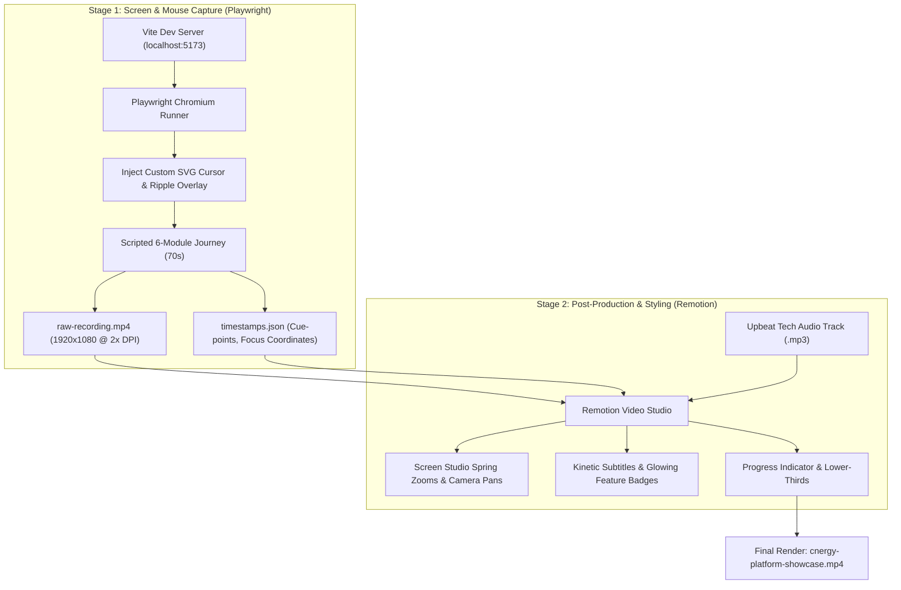

# Automated Product Showcase Video: Design & Architecture Specification

## 1. Executive Summary & Purpose
This document defines the complete technical and creative architecture for producing an automated, professional **70-second product showcase video** of the Datlion Cnergy Battery Plant Inventory & ERP platform.

The video serves as a high-conversion sales presentation for prospective battery manufacturing clients. It demonstrates a realistic, continuous manufacturing journey from raw cell inwarding to cell testing, pack assembly, live BOM cost calculation, finished pack traceability, and the commercial ERP suite.

---

## 2. Key Requirements & Scope
- **Duration:** Exactly 70 seconds.
- **Aspect Ratio & Resolution:** 16:9 Full HD (1920×1080) at 30 or 60 FPS.
- **Presentation Style:** Fast-paced SaaS promo with dynamic camera zoom/pan (Screen Studio style), realistic curved mouse pointer movement with click ripples, kinetic animated subtitles, glassmorphic badges, and upbeat electronic background music (no voiceover required).
- **Core Narrative (6 Highlighted Modules):**
  1. `00:00–00:12`: **Raw Material Inwarding & Valuation** (Compact card grid, unit purchase cost, stock value, invoice batch drawer).
  2. `00:12–00:22`: **Cell Testing & QC** (Voltage, IR resistance, automated capacity grading).
  3. `00:22–00:32`: **WIP Assembly & Batch Production** (Production run start, automated component deduction).
  4. `00:32–00:44`: **Live BOM Costing Engine** (Direct raw material cost roll-up, custom margin, dealer/retail tiers with and without GST).
  5. `00:44–00:56`: **Finished Packs & Traceability** (Pack release, unit IDs, serial-to-pack full genealogy search).
  6. `00:56–00:70`: **Commercial ERP Suite & Outro** (GST Invoice Maker, Company Profiles, Tasks, Expenses, Price List & CTA).

---

## 3. System Architecture & Tooling Stack

### Component Breakdown
1. **Playwright Script (`scripts/record-showcase.ts`)**:
   - Launches headless or visible Chromium with `recordVideo: { dir: './recordings', size: { width: 1920, height: 1080 } }`.
   - Injects `scripts/cursor-overlay.js` into the DOM. This draws a clean SVG pointer that follows `page.mouse.move()` along Bezier curves and spawns CSS expanding rings on click.
   - Logs entry/exit timestamps and focal point coordinates `(x, y)` to `recordings/timestamps.json`.
2. **Remotion Studio (`video/`)**:
   - **`Root.tsx`**: Defines the 70s composition (2100 frames @ 30 FPS).
   - **`ScreenStudioCamera.tsx`**: Uses Remotion `spring()` to smoothly zoom into the focal coordinates whenever a key action happens, and zooms out to wide angle during page transitions.
   - **`KineticSubtitles.tsx`**: Renders glassmorphic, glowing pill subtitles with staggered fade/slide transitions synchronized to `timestamps.json`.
   - **`AudioTrack.tsx`**: Mixes royalty-free background music with subtle volume ducking on scene transitions.

---

## 4. Complete Storyboard & Timeline

| Time | Scene | On-Screen Interaction & Mouse Focus | Kinetic Subtitle / Badge Overlay |
|---|---|---|---|
| **00:00–00:12** | **1. Raw Materials & Valuation** | Mouse glides over compact cards; clicks `Purchase Unit Cost` badge on 18650 Cell to open card edit modal, displaying stock valuation and invoice batches. | 🏷️ **Smart Raw Material Inwarding** *Real-time unit costs & plant stock valuation* |
| **00:12–00:22** | **2. Cell Testing & Grading** | Navigates to Cell Testing; highlights IR resistance, voltage, and grade sorting. | 🧪 **Automated Cell Grading & QC** *Precision IR, voltage & capacity sorting* |
| **00:22–00:32** | **3. WIP Production Line** | Clicks into Work in Progress; launches 12.8V pack assembly run showing live component deduction. | ⚙️ **WIP Assembly & Production** *Automated inventory deduction per pack* |
| **00:32–00:44** | **4. Live BOM Costing Engine** | Switches to Finance Costing; selects battery SKU, shows component cost roll-up, adjusts dealer & retail margin tiers with/without GST. | 🧮 **Live BOM Costing Engine** *Instant unit cost roll-up & profit margins* |
| **00:44–00:56** | **5. Finished Packs & Traceability** | Enters Finished Goods; demonstrates unit IDs and searches serial genealogy in Traceability from raw cell to finished pack. | 📦 **Finished Goods & Traceability** *End-to-end cell-to-pack serial genealogy* |
| **00:56–00:70** | **6. Commercial ERP Suite & Outro** | Rapid tour across GST Invoice Maker, Supplier Directory, Employee Tasks, and Expenses, concluding with brand logo and contact CTA. | 💼 **Complete Plant ERP Operations** *Invoicing, Supplier Directory, Tasks & Expenses* |

---

## 5. Technical Decision Log

| ID | Decision Item | Choice | Rationale |
|---|---|---|---|
| **DEC-01** | Video Format | Single 70s End-to-End Clip | Fast-paced, continuous customer story. |
| **DEC-02** | Audio Style | Upbeat Music + Kinetic Subtitles | No voiceover coordination required; clean SaaS promo style. |
| **DEC-03** | Architecture | Playwright + Remotion Pipeline | Decouples browser recording from motion graphic styling. |
| **DEC-04** | Timing Interface | `timestamps.json` Cue-Sheet | Guarantees subtitles and camera pans match click events. |
| **DEC-05** | Scene Allocation | 10–12s per module + 2s CTA | Keeps viewer engaged without lingering on static screens. |
| **DEC-06** | Focus Interaction | Click on Raw Material Cost & BOM Spreadsheet | Demonstrates the most critical commercial workflows for plant buyers. |
| **DEC-07** | Cursor Animation | Bezier Interpolation + Ripple DOM overlay | Produces human-like, fluid pointer movement. |
| **DEC-08** | Recording Resolution | 1920×1080 with `deviceScaleFactor: 2` | Ensures zero blurriness during zoom-ins. |
| **DEC-09** | Wait Mechanics | Element state assertions (`waitForSelector`) | Prevents timing drifts or broken clicks. |

---

## 6. Implementation Stages
1. **Setup Playwright Recorder**: Add `@playwright/test` and develop `scripts/record-showcase.ts` with SVG mouse overlay and realistic Bezier movement.
2. **Execute Video Recording**: Run the script against the local app to produce `raw-recording.mp4` and `timestamps.json`.
3. **Setup Remotion Project**: Initialize lightweight Remotion composition with camera zoom, kinetic subtitle overlays, and upbeat audio track.
4. **Render Output**: Execute `npx remotion render` to generate `out/cnergy-platform-showcase.mp4`.
